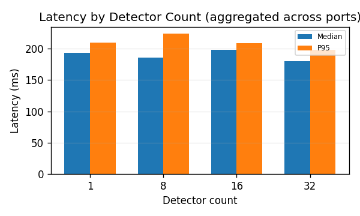
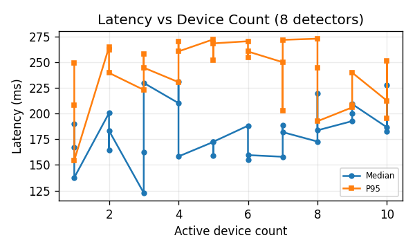
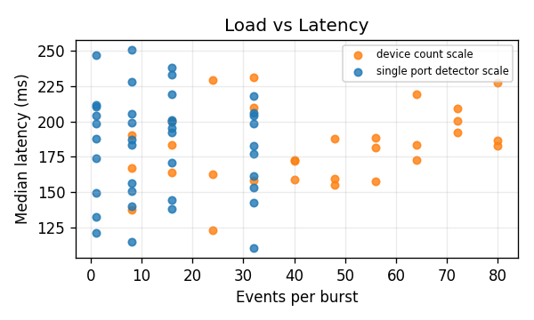
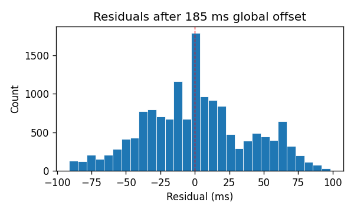

# SNMP Detector Event Latency — Scaling Study

**Date:** 2026-04-02  
**Scenarios:** 70 completed, 0 failed  
**Planned runtime:** 29m 9s

---

## Background

This study measures the round-trip latency of SNMP-based detector event replay against
MAXTIME emulator devices. A single controller is addressed over UDP; detector ON/OFF events
are fired on a fixed schedule, and the controller's HTTP event log is polled to confirm receipt.
Latency is defined as the difference between the scheduled send time and the logged timestamp.

Two phases were run:

- **Single-port detector scaling** — one device active at a time, sweeping detector counts
  (1,8,16,32) across all 10 ports (9701,9702,9703,9704,9705,9706,9707,9708,9709,9710).
  Port order is randomized within each detector-count block (seed 20260402),
  so port identity and execution sequence are not aliased.
- **Device-count scaling** — 3× repeated, 8 detectors per device,
  stepping from 1 to 10 active devices.
  Each repetition uses a different random port selection and level ordering, giving genuine
  replication across the full device-count range.

Each scenario replayed ON/OFF bursts every 5 s (hold 1 s) for 20 s.

---

## Calibration recommendation

> **Use a single global latency offset of 185.3 ms. Do not condition it on detector count or device count.**

After subtracting 185.3 ms from each event:

- Median absolute residual: **24.8 ms**
- P95 absolute residual: **74.1 ms**
- Events within ±50 ms: **78%**
- Events within ±100 ms: **100%**

The rationale is in the statistical tests below — neither detector count nor device count
produced a statistically significant effect, so a single fixed offset is the right choice.

---

## Statistical tests

All p-values are permutation-based (20 000 permutations). Effect sizes for categorical factors
are partial η²; for continuous factors, Pearson r and Spearman ρ are reported.

| Factor | Effect size | Permutation p | Significant? |
| --- | --- | --- | --- |
| Detector count (single-port phase) | η² = 0.076 | 0.760 | No |
| Device count (8-detector phase) | r = 0.309, ρ = 0.285 | 0.098 | No |
| Overall burst load (all scenarios) | r = 0.072, ρ = 0.021 | 0.552 | No |
| Port / run-order proxy† | η² = 0.604 | <0.001 | Yes† |

† Port order within each detector-count block was randomized, so a significant effect here
indicates genuine per-instance latency variance across emulator ports — not an execution-order artefact.
(η² = 0.604,
p <0.001)

---

## Offset model comparison

Comparing a single global offset against per-detector-count and per-device-count tables.
MAE and P95 are computed over matched event residuals.

| Offset model | Offset value | MAE (ms) | P95 error (ms) | Within ±100 ms |
| --- | --- | --- | --- | --- |
| Single global offset | 185.3 ms | 30.1 | 74.1 | 100% |
| Per-detector-count (4 values) | varies | 29.3 | 75.5 | 100% (+2.9%) |
| Per-device-count (10 values) | varies | 28.2 | 86.1 | 99% (+6.1%) |

Per-detector-count offsets improve MAE by only 2.9% — not worth the added complexity.
Per-device-count offsets show a larger nominal improvement (6.1%) but the relationship
is non-monotonic (see table below) and the correlation is not statistically significant,
so it likely reflects noise rather than a real trend.

---

## Results by detector count

Median and P95 aggregated across all ports (10 runs per detector count).

| Detectors | Median (ms) | P95 (ms) | Runs |
| --- | --- | --- | --- |
| 1 | 193 | 209 | 10 |
| 8 | 185 | 223 | 10 |
| 16 | 198 | 209 | 10 |
| 32 | 180 | 198 | 10 |

---

## Results by device count (at 8 detectors)

One scenario per device count.

| Active devices | Median (ms) | P95 (ms) | Missing events |
| --- | --- | --- | --- |
| 1 | 167.3 | 249.1 | 0 |
| 1 | 190.3 | 208.4 | 0 |
| 1 | 137.7 | 154.4 | 0 |
| 2 | 200.4 | 264.6 | 0 |
| 2 | 164.2 | 261.7 | 0 |
| 2 | 183.3 | 239.5 | 0 |
| 3 | 122.8 | 223.0 | 0 |
| 3 | 162.4 | 257.8 | 0 |
| 3 | 229.7 | 244.5 | 0 |
| 4 | 210.1 | 230.5 | 0 |
| 4 | 231.2 | 269.9 | 0 |
| 4 | 158.2 | 260.4 | 0 |
| 5 | 172.3 | 272.0 | 0 |
| 5 | 159.0 | 252.0 | 0 |
| 5 | 172.5 | 268.2 | 0 |
| 6 | 188.1 | 270.2 | 0 |
| 6 | 154.8 | 254.7 | 0 |
| 6 | 159.5 | 260.3 | 0 |
| 7 | 157.9 | 249.8 | 0 |
| 7 | 188.6 | 202.8 | 0 |
| 7 | 181.9 | 271.6 | 0 |
| 8 | 172.7 | 272.7 | 0 |
| 8 | 219.4 | 244.4 | 0 |
| 8 | 183.6 | 192.4 | 0 |
| 9 | 192.6 | 205.9 | 0 |
| 9 | 200.2 | 208.2 | 0 |
| 9 | 209.1 | 239.7 | 0 |
| 10 | 186.6 | 212.4 | 0 |
| 10 | 227.8 | 251.0 | 0 |
| 10 | 182.7 | 195.2 | 0 |

---

## Charts

---

## Study configuration

| Parameter | Value |
| --- | --- |
| Controller IP | 127.0.0.1 |
| Ports | 9701,9702,9703,9704,9705,9706,9707,9708,9709,9710 |
| Detector counts tested | 1,8,16,32 |
| Device-count phase detectors | 8 |
| Scenario duration | 20 s |
| Burst interval / hold | 5.0 s / 1.0 s |
| Warmup | 2.0 s |
| Collection window | 6.0 s |
| Total scenarios | 70 |
| Run folder | latency_scaling_study_20260402_120404 |
